# InformationGathering
Information Gathering Techiques

# To perform information gathering techniques

# AIM:

To perform information gathering techniques using kali linux 

## STEPS:

### Step 1:

Install kali linux either in partition or virtual box or in live mode

### Step 2:

Investigate on the various categories of tools as follows:

### Step 3:
Open terminal/browser and try execute necessary commands/use url to perform information gathering

## Pen Test Tools Categories:  

Following Categories of pen test tools are identified for information gathering:

Footprinting is a part of the reconnaissance process which is used for gathering possible information about a target computer system or network.
http://www.whois.com/whois website to get detailed information about a domain name information including its owner, its registrar, date of registration, expiry, name server, owner's contact information, etc.

## OUTPUT:

## Finding IP address:
ping command is available on Windows as well as on Linux OS. Following is the example to find out the IP address of facebook.com.
## output

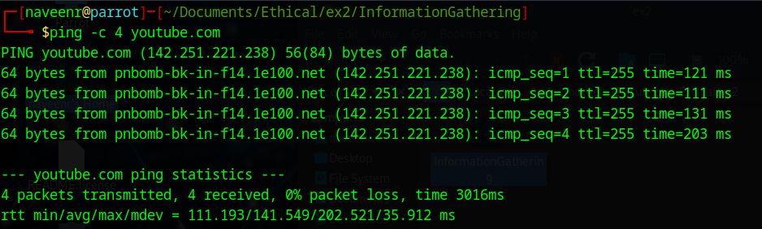

## Finding Hosting Company
get further detail by using ip2location.com website.
## output

## History of the website:
## output
https://web.archive.org/

# Webserver Fingerprinting:

## Netcat:
sudo nc example.com 80
GET / HTTP/1.1
Host: example.com

### output

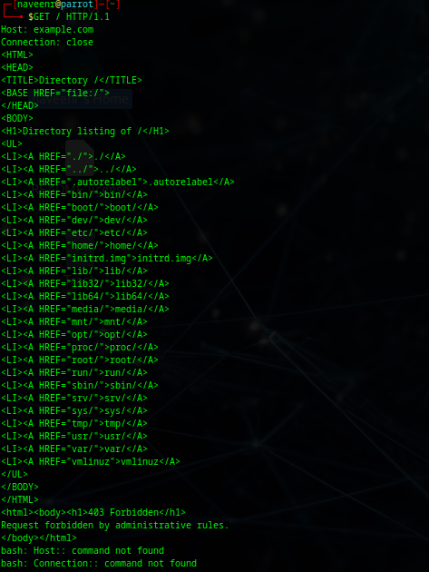

## nmap:
### output

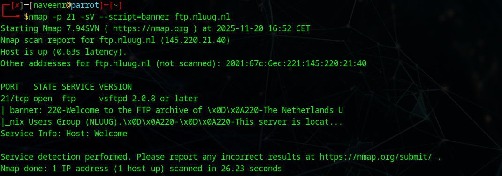

## Whatweb
### output

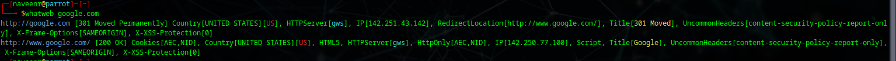
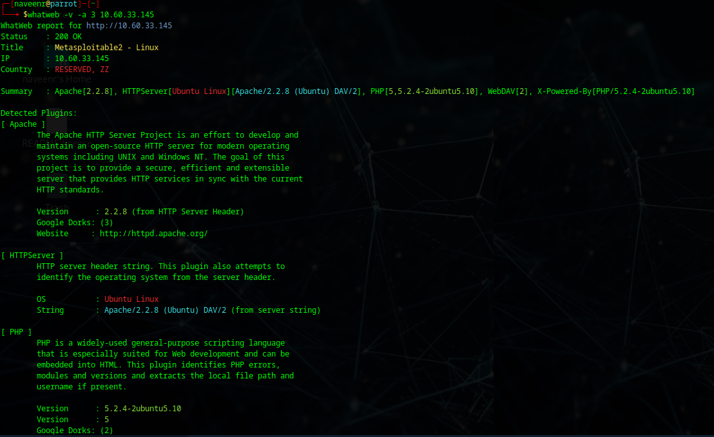
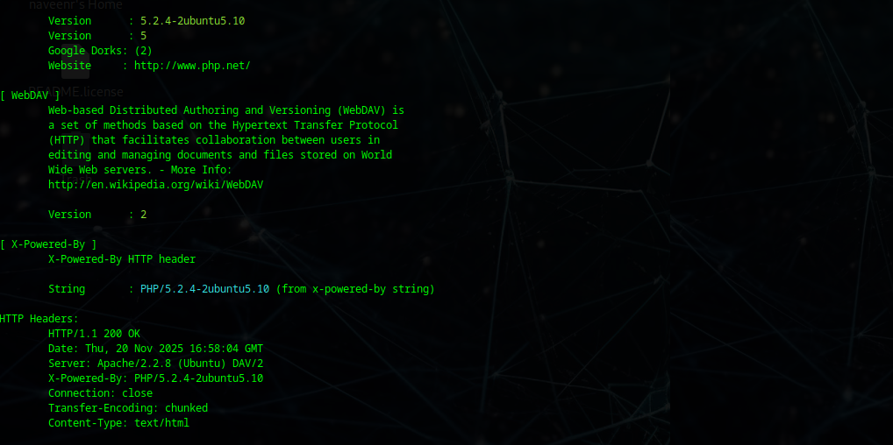

## httprint
### output

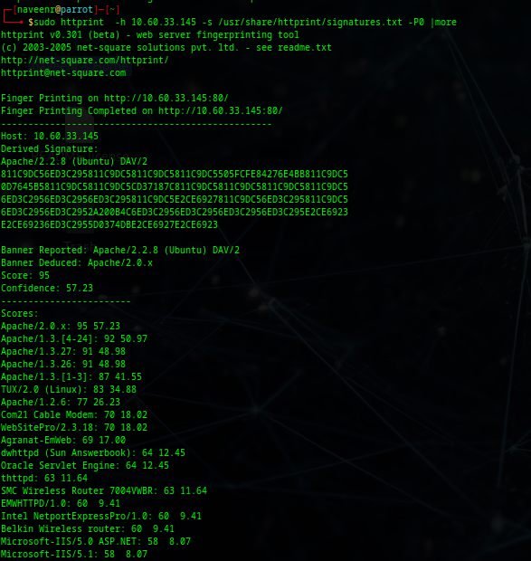

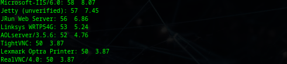

# Tracing the Location
TCP Traceroute:
sudo traceroute -T www.google.com
## output

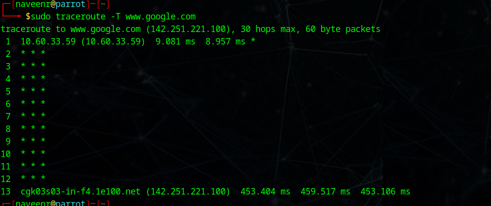

## UDP Traceroute:
sudo traceroute -U www.google.com
## output

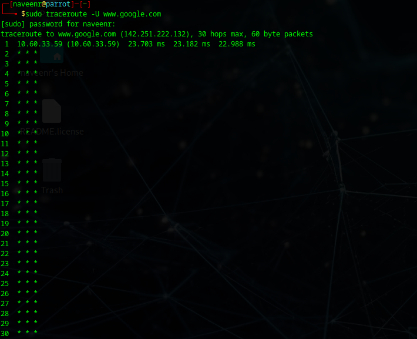

## ICMP Traceroute:
sudo traceroute  www.google.com
## output

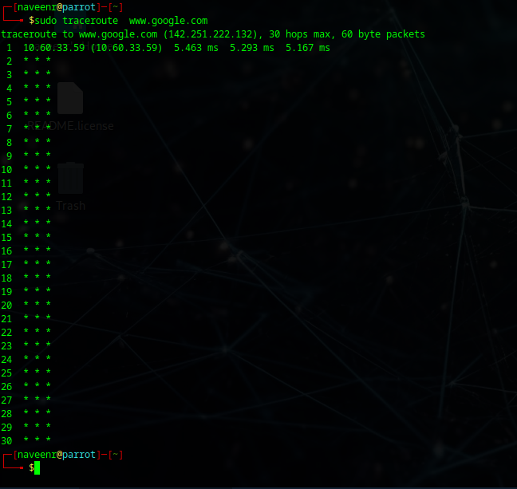

## RESULT:
The information gathering techniques tools/procedure were  identified successfully
